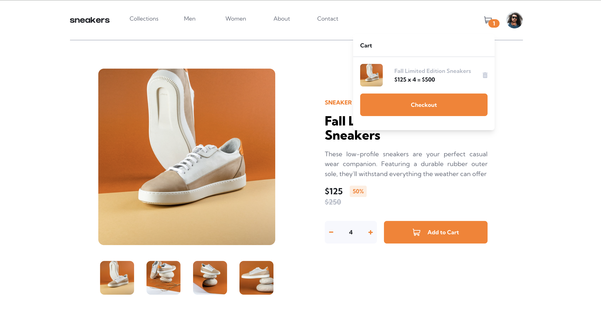

# Frontend Mentor - E-commerce product page solution

This is a solution to the [E-commerce product page challenge on Frontend Mentor](https://www.frontendmentor.io/challenges/ecommerce-product-page-UPsZ9MJp6). Frontend Mentor challenges help you improve your coding skills by building realistic projects.

### Screenshot

### Links

- Live Site URL: [Add live site URL here](https://my-eproductpage.netlify.app/)

### Built with

- [Vite](https://vitejs.dev/) - Frontend Tooling
- [React](https://reactjs.org/) - JS library
- [Tailwind CSS](https://tailwindcss.com/) - For styles

### What I learned

From this project, I learned,
- how to use useState, useRef useReducer and useContext
- custom animation with TailwindCSS
- 

## Author

- Frontend Mentor - [@ysolomontuangpu](https://www.frontendmentor.io/profile/solomontuangpu)
- Twitter - [@solomontuangpu](https://www.twitter.com/solomontuangpu)

## Acknowledgments

Thank you so much frontend metor team for this wonderful project. 
